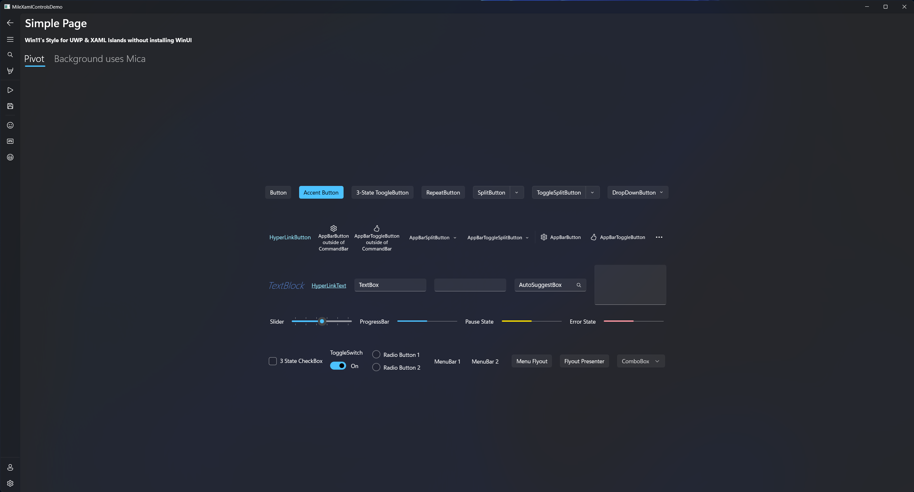
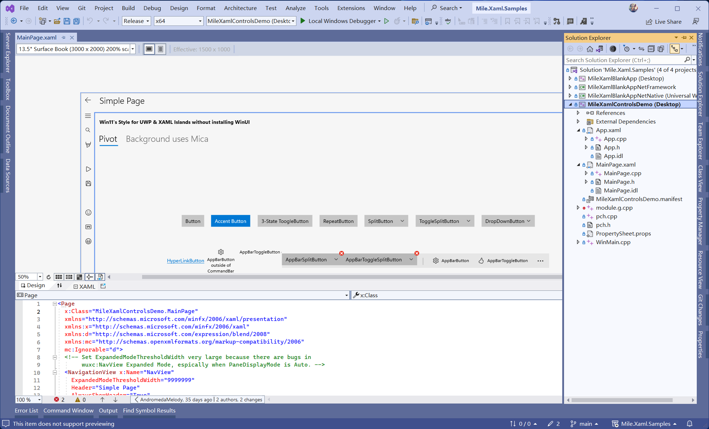

# Mile.Xaml

[](https://www.nuget.org/packages/Mile.Xaml)





Mile.Xaml is the lightweight XAML Islands toolchain with the Windows 11 controls
styles. It was originally created for improving the development and deployment
experience in modernization of [NanaZip](https://github.com/M2Team/NanaZip). For
validating the usability of this, [NanaBox](https://github.com/M2Team/NanaBox)
and [NanaGet](https://github.com/M2Team/NanaGet) were also created.

## Features

- Provide XAML Compiler, XAML Designer and XAML Hot Reload support.
- Provide Windows 11 XAML controls styles for Windows Runtime XAML controls.
- Provide C/C++ projects, .NET Framework (Visual Studio 2022 Version 17.9.0 or
  later), and Modern .NET (.NET 8.0 or later) projects support.
- Integrate all features from Microsoft.Toolkit.Win32.UI.XamlApplication.
- Provide support for responding to Windows theme changes from dark to light
  or vice versa at run time.
- Integrate several XAML Islands workarounds.
- Provide Mile.Xaml.ContentWindow window class for simplifying the development.
- Provide immersive Mica effect support Mile.Xaml.ContentWindow window class.
- Provide Win32 context menu dark mode support.
- Use [VC-LTL 5.x](https://github.com/Chuyu-Team/VC-LTL5) toolchain to make the
  binary size smaller.
- Provide NuGet package.

## Usage

You only need to search and add `Mile.Xaml` package in your NuGet client.

There are [some samples](https://github.com/ProjectMile/Mile.Xaml.Samples)
that demonstrate using XAML Islands with Mile.Xaml. We hope it can help you
develop applications with Mile.Xaml and enjoy the beauty of XAML Islands.

If you don't want to deploy Windows 11 XAML controls styles for Windows Runtime
XAML controls (Mile.Xaml.Styles.SunValley.xbf) to your project's output folder,
please set `<MileXamlNoSunValleyXamlStyle>true</MileXamlNoSunValleyXamlStyle>`
in your project configuration file.

## Notes About Modern .NET Support

Modern .NET support is based on the 
[official UWP Support in .NET 9 SDK](https://devblogs.microsoft.com/ifdef-windows/preview-uwp-support-for-dotnet-9-native-aot/), 
which requires the following components:

- .NET 9.0 SDK
- Visual Studio 2022 v17.12
- Windows 11 SDK 26100.2454

If you see similar errors during build: 

```
error MSB4064: The "UsingCsWinRT" parameter is not supported by the "CompileXaml" task loaded from assembly: Microsoft.Windows.UI.Xaml.Build.Tasks, Version=0.0.0.0, Culture=neutral, PublicKeyToken=31bf3856ad364e35 from the path: C:\Program Files (x86)\Windows Kits\10\bin\10.0.26100.0\XamlCompiler\Microsoft.Windows.UI.Xaml.Build.Tasks.dll. Verify that the parameter exists on the task, the <UsingTask> points to the correct assembly, and it is a settable public instance property.
```

You may need to upgrade your Windows SDK, which can be downloaded from https://developer.microsoft.com/en-us/windows/downloads/windows-sdk/.

## System Requirements

- Supported OS: Windows 10 Version 2004 (Build 19041) or later
- Supported Platforms: x86, x86-64(AMD64) and ARM64

## Documents

- [License](https://github.com/ProjectMile/Mile.Xaml/blob/main/License.md)
- [Release Notes](https://github.com/ProjectMile/Mile.Xaml/blob/main/ReleaseNotes.md)
- [Versioning](Documents/Versioning.md)

## Credits

Note: This list sort in alphabetical order.

- AndromedaMelody, https://github.com/AndromedaMelody
- driver1998, https://github.com/driver1998
- Kenji Mouri, https://github.com/MouriNaruto
- Yifei Gao (高怡飞), https://github.com/Gaoyifei1011
